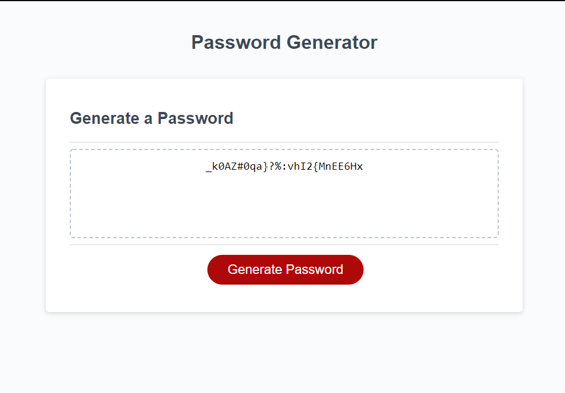

# password-generator
This application will generate random passwords based on a user selected criteria. It runs in the browser and is responsive, and dynamic. It will include an array of letters from a to z and A to Z, special characters such as @,%,+,\\,/,',#,$,^,?,:,`,),(,},{,],[,~,-,-. and also numbers.
This application will be used to generate strong passwords to to offer a higher level of password security.

# Technologies used
### CSS
### HTML
### JavaScript
### JQuery
### Bootstrap

This project can be accessed through the github repo link below
[GitHub Repository](https://github.com/Terd47/password-generator)

[live site](https://terd47.github.io/password-generator/)

